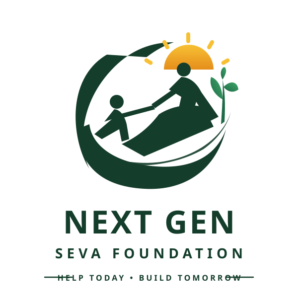

# Next Gen Seva Foundation — Kolkata

<p align="center">
  
</p>

<p align="center">
  <strong>HELP TODAY • BUILD TOMORROW</strong><br/>
  <em>A youth-led humanitarian movement serving Kolkata since 2021</em>
</p>

<p align="center">
  <a href="https://www.instagram.com/_the_next_gen_seva_foundation_/">
    
  </a>
</p>

---

## 🌟 Overview

**Next Gen Seva Foundation** is a grassroots youth NGO active across Kolkata (Dum Dum, Sealdah station corridors, street dividers, basti lanes, and shelter homes) since 2021. This web platform bridges immediate humanitarian relief with long-term youth empowerment.

### Core Grassroots Initiatives Grounded in Real Fieldwork:
1. 🍲 **Aahaar Seva (Night Platform Hunger Relief)**: Late-night hot meal distribution at **Dum Dum railway station** and city street dividers for elderly destitute individuals.
2. 🥋 **Project Shakti (Free Youth Karate)**: Free martial arts coaching, karate uniforms (*gi*), and self-defense training for underprivileged children and girls.
3. 🎨 **Project Rang (Street Art & Creative Discovery)**: Open-air drawing competitions on basti pavements with art & stationery kits.
4. 🎂 **Project Khushiyan (Orphanage Birthday Celebrations)**: Bringing birthday cakes, balloons, and personal gifts to children in shelter homes.
5. 👕 **Poshak Seva (Warmth & Relief)**: Distributing clean clothing and winter blankets to frail street dwellers.

---

## 🚀 Quick Start (Local Development)

```bash
# Install dependencies
npm install

# Start local development server
npm run dev

# Build for production
npm run build
```

The app will run locally on `http://localhost:3000`.

---

## ☁️ Deployment Guide

### Deploy to Vercel (Recommended)
1. Go to [Vercel](https://vercel.com/) and click **Add New Project**.
2. Import `Sombodhi006/next-gen-seva-foundation`.
3. Framework Preset: **Vite** (auto-detected).
4. Click **Deploy**! It will build and go live in seconds.

### Deploy to Netlify
1. Go to [Netlify](https://www.netlify.com/) and click **Add new site** > **Import an existing project**.
2. Select `Sombodhi006/next-gen-seva-foundation`.
3. Build command: `npm run build`
4. Publish directory: `dist`
5. Click **Deploy**!

---

## 📂 Project Structure

```
├── public/
│   ├── logo.svg              # Vector reproduction of the foundation emblem
│   └── images/               # High-res on-ground Kolkata drive photos
│       ├── dumdum_platform_feeding.png
│       ├── free_karate_coaching.png
│       ├── orphanage_birthday_celebration.png
│       ├── basti_drawing_competition.png
│       ├── youth_volunteers_angels.png
│       ├── night_feeding_elderly.png
│       ├── street_feeding_elderly.png
│       └── day_food_cart.png
├── src/
│   ├── components/
│   │   ├── Navbar.jsx         # Sticky header with quick actions & Instagram link
│   │   ├── Hero.jsx           # Impact headline & Kolkata photo spotlight
│   │   ├── ImpactStats.jsx    # Live animated counters (35,000+ meals, etc.)
│   │   ├── DrivesShowcase.jsx # Tabbed view of the 5 real Kolkata initiatives
│   │   ├── AngelsSection.jsx  # Tribute to youth volunteers with real photo
│   │   ├── PhotoJournal.jsx   # Filterable gallery with lightbox previews
│   │   ├── InstagramConnect.jsx # Live social proof banner
│   │   ├── DonationModal.jsx  # Impact tiers, calculator & simulated tax receipt
│   │   ├── VolunteerModal.jsx # Kolkata volunteer onboarding form
│   │   └── Footer.jsx         # Kolkata operations note & legal disclaimers
│   ├── data/
│   │   └── ngoData.js         # Central configuration for drives, stats, tiers & FAQs
│   ├── App.jsx                # Main layout coordinator
│   ├── index.css              # Custom design system with brand tokens & typography
│   └── main.jsx               # React DOM root
├── index.html                 # SEO metadata & Google Fonts
└── vite.config.js             # Vite configuration
```

---

## 📄 License & Attribution

Designed and developed for **Next Gen Seva Foundation**, Kolkata.  
*"Help Today • Build Tomorrow"*
